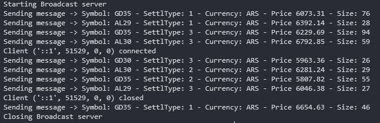
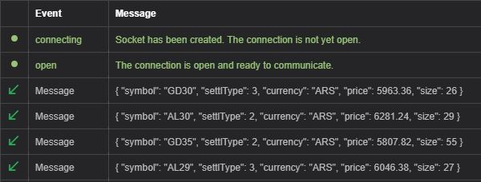

# BroadcastServer

BroadcastServer is a minimal example of data broadcasting.

## Installation

```bash
git clone https://github.com/matiasdamelio/broadcast_server.git
pip install -r requirements.txt
```

## Usage

```bash
python server.py
```

## Example
### Server Side

### Client Side


## License
[MIT](https://choosealicense.com/licenses/mit/)